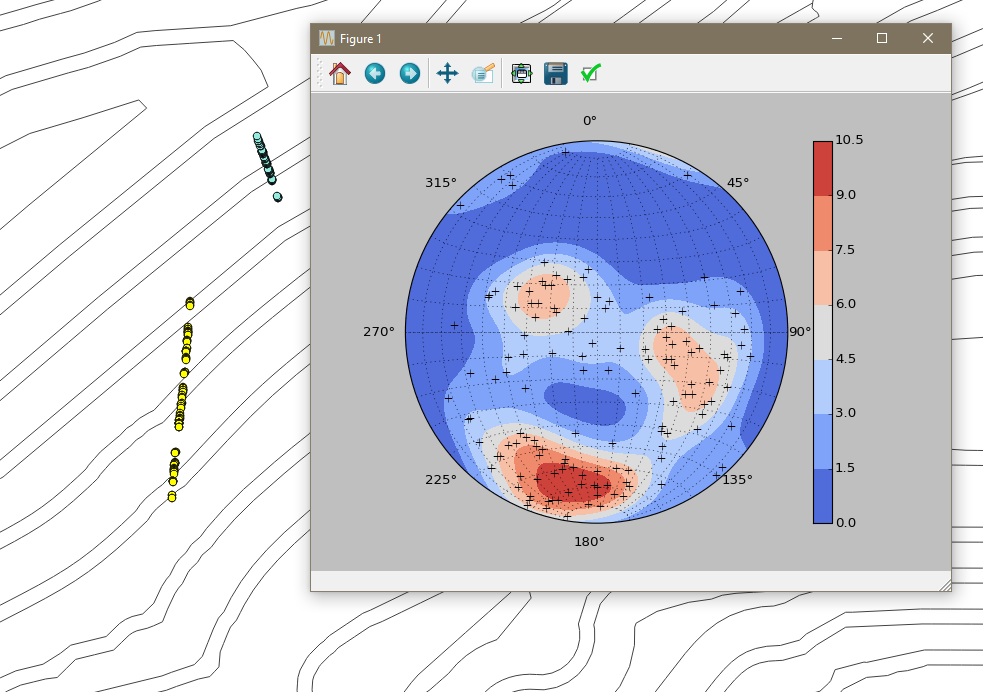

# Stereonet

Stereonet is a QGIS plugin that generates a sterenot of geologic structures based on imported CSV data.

### Example
Lets say you have a drill hole and want to plot the geologic stereonet of a bunch of structures. 

1. The data needs to be formatted as shown in the "Required Inputs" section.
2. Add a delimited text layer to the project.
3. Select your layer, and use the "Select Features" tool to pick out what points you want plotted.
4. Once points are selected, click the Stereonet icon. 
5. You should get a plot like this! 

### Required Inputs
 - A CSV file containing data points with an easting, northing, dip direction, and dip column. (The dip direction and dip column NEED to be named "ddr" and "dip", respectively)

### Known Bugs
* Clicking on most anything in the matplotlib menu bar crashes QGIS. I'm working on getting that removed.
* When resizing the window, the orientation markers do not move with the stereonet. Bug has been reported here: https://github.com/joferkington/mplstereonet/issues/15
